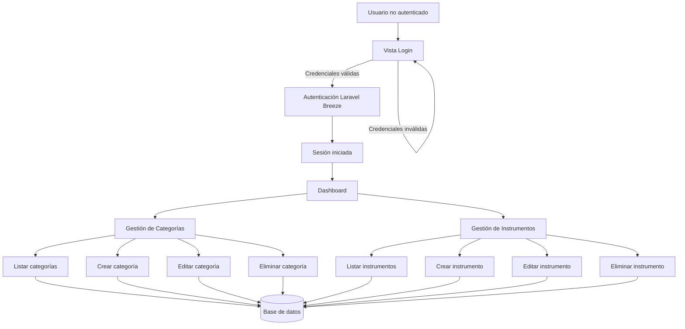

<h1 align="center">Music Store CRUD- Un CRUD con Laravel Breeze</h1>

## Descripcion
Este CRUD es una práctica de Laravel 12 para la asignatura de Desarrollo en entorno servidor de DAW. Simula un catálogo de instrumentos clasificados en distintas categorías. La autenticación y seguridad del acceso a la aplicación corre a cargo de ``Laravel Breeze``.

## Tecnologías utilizadas
<table align="center">
<tr>
<td align="center">
  
  <br>
  <strong>Laravel 12</strong>
</td>
<td align="center">
          
  <br>
  <strong>Alpinejs</strong>
</td>
<td align="center">
    
    <br>
    <strong>Tailwindcss</strong>
</td>
    <td align="center">
        
          <br>
        <strong>Vite</strong>
    </td>
</tr>
</table>

## Requisitos previos
1. Servidor Apache
2. Php versión ``8.3 o superior``
3. MySQL versión ``8.0``

## Instalación
1. Clone el repositorio:
   ```bash
   git clone https://github.com/cjag99/bestiaryAPI.git
   ```
2. Instale dependencias:
   ```bash
   composer install
   ```
3. Crea el fichero ``.env`` con el siguiente comando:
   ```bash
   cp .env.example .env
   ```
4. Cambie las variables de entorno de conexión a base de datos del fichero ``.env`` siguiendo los ejemplos de ``.env.example``:
   ```.env
   DB_CONNECTION=mysql
   DB_HOST=your_host
   DB_PORT=your_port
   DB_DATABASE=your_database
   DB_USERNAME=your_usernamme
   DB_PASSWORD=your_password
   ```
5. Generar la APP_KEY con el siguiente comando:
   ```bash
   php artisan key:generate
   ```
6. Realizar la migración de base de datos y el sembrado de datos de ejemplo para la api:
   ```bash
   php artisan migrate --seed
    ```
7. Como las vistas usan tanto Alpinejs como Tailwind, los cuales necesitan ser compilados por Vite mediante el siguiente comando:
   ```node
       npm run build
   ```
7. Con esto estaría todo listo. Solo quedaría iniciar la aplicación con el comando:
   ```bash
   php artisan serve
   ```

## Autenticación con Laravel Breeze
La autenticación está implementada mediante ``Laravel Breeze``, una solución ligera que utiliza el sistema de autenticación nativo de Laravel, sesiones y middlewares para gestionar el acceso de usuarios de forma segura.
### ¿Qué proporciona Laravel?
+ Vistas Blade para registro de usuarios, inicio y cierre de sesión, y verificación opcional de email
+ Protección de rutas mediante el middleware ``Auth``
+ Cookies seguras
+ Middlewares
+ Controllers
### Flujo básico de autenticación
1. El usuario se registra o inicia sesión desde las vistas proporcionadas por Breeze.
2. Laravel valida las credenciales contra la base de datos.
3. Si son correctas, se crea una sesión autenticada.
4. Las rutas protegidas con el middleware auth solo son accesibles para usuarios autenticados:
   ```php
   Route::middleware('auth')->group(function () {
    Route::get('/profile', [ProfileController::class, 'edit'])->name('profile.edit');
    Route::patch('/profile', [ProfileController::class, 'update'])->name('profile.update');
    Route::delete('/profile', [ProfileController::class, 'destroy'])->name('profile.destroy');
    });
   ```
### Los middlewares de Laravel Breeze
Breeze usa principalmente:
+ ``auth``-> para usuarios logueados
+ ``guest``-> para usuarios no logueados
  ```php
  Route::middleware('guest')->group(function () {
    Route::get('register', [RegisteredUserController::class, 'create'])
        ->name('register');
  ....
  };
  ```
### Controllers de Laravel Breeze
Breeze instala controladores como:
* AuthenticatedSessionController
* RegisteredUserController
* PasswordResetLinkController

Estos controladores:
* Validan formularios
* Autentican usuarios
* Redireccionan correctamente

## Flujo de uso de la aplicación

## Ususarios de ejemplo de la aplicación
Pese a que existe la posibilidad de registrarse gracias a ``Laravel Breeze``, se proporcionan 6 usuarios de ejemplo que se crean con el método ``Factory`` del modelo User de ``Eloquent``. Todos comparten la misma contraseña ``password``. 5 de ellos poseen un email aleatorio, mientras que el primero tiene como email ``test@example.com`` siendo así el "usuario por defecto".
## Vistas de la aplicación
 ### Vistas con middleware guest
 <table align="center">
 <tr>
     <td align="center">
         <strong>Welcome / Landing Page</strong>
     </td>
     <td align="center">
         <strong>Login</strong>
     </td>
     <td align="center">
         <strong>Register</strong>
     </td>
     <td align="center">
         <strong>Reset password</strong>
     </td>
 </tr>
 </table>
 ### Vistas con middleware auth
 <table align="center">
 <tr>
     <td align="center">
         <strong>Dashboard</strong>
     </td>
     <td align="center">
         <strong>Profile</strong>
     </td>
     <td align="center">
         <strong>Categories index</strong>
     </td>
     <td align="center">
         <strong>Instruments index</strong>
     </td>
 </tr>
 </table>
 Las operaciones CRUD no son vistas Blade como tal. Se muestran y acceden a ellas mediante modales accesibles con botones que se encuentran en las vistas index de cada tabla.
